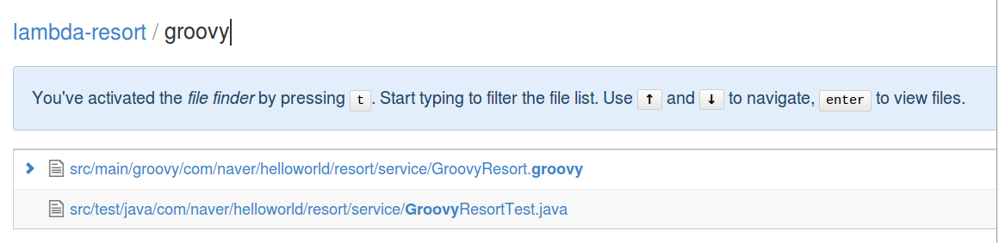
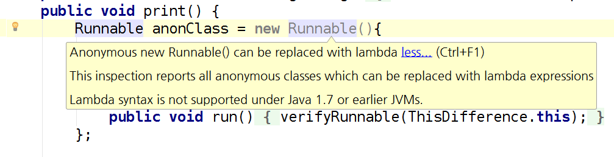
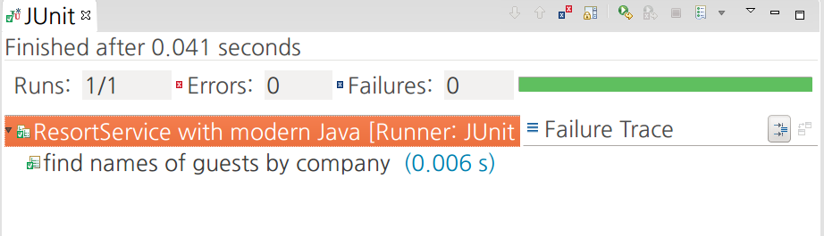

# 람다가 이끌어 갈 모던 Java
람다 표현식은 논리학자인 Alonzo Church가 1930년대에 제안한 람다 대수에서 유래했습니다. 람다 대수는 함수 정의, 함수 적용, 귀납적 함수를 추상화한 형식 체계입니다. 람다 표현식은 함수를 간결하게 표현합니다. 프로그래밍 언어의 개념으로는 단순한 익명 함수 생성 문법이라 이해할 만합니다.

람다 표현식이 들어간 Java 8에 별명을 붙인다면 ‘모던보이’라 부르고 싶습니다. ‘모던’이라 부르는 양식은 시대가 지나면 유행이 지난 양식이 됩니다. 하지만 ‘모던’은 특정 시점에서는 과거와 대비되는 큰 변화를 설명하기에 유용한 표현입니다. 그래서 이 글에서는 Java 8 이후를 ‘모던 Java’, 그 이전을 ‘클래식 Java’라고 부르겠습니다.

이 글에서는 Java는 물론 JVM(Java virtual machine)에서 실행되는 언어에서 람다 표현식을 둘러싸고 어떤 시도와 논쟁이 있었는지, 람다가 Java 생태계에 어떤 영향을 미칠지 살펴보겠습니다.

## <span id="ch1">컬렉션 처리</span>
여러 객체를 모아서 담는 자료구조인 컬렉션을 다루는 코드로 이 글을 시작하겠다. 객체를 필터링, 정렬, 변환하는 예제를 Java 7까지 주로 사용한 방식으로 만들어 보겠다. 다음과 같이 grade, name, company 속성이 있는 Guest 객체가 있다.

<span class="caption">예제 1 Guest 객체의 속성([Guest.java](https://github.com/benelog/lambda-resort/blob/master/src/main/java/com/naver/helloworld/resort/domain/Guest.java))</span>

```java
public class Guest {
    private final int grade;
    private final String name;
    private final String company;
    // 게터 메서드 등은 생략
}
```

>	**예제 코드**  
>	이 글에서 설명한 예제 코드는 GitHub 저장소에 공개했다.  
>	- GitHub 저장소: https://github.com/benelog/lambda-resort  
>	전체 소스를 보고 싶으면 예제에 표시한 파일명을 검색해 찾기 바란다. 브라우저에서 GitHub 저장소 페이지를 열고 T 키를 누르면 파일명으로 쉽게 파일을 검색할 수 있다.  


그리고 Guest 객체를 저장소에서 불러오는 GuestRepository라는 인터페이스가 있다.

<span class="caption">예제 2 GuestRepository 인터페이스([GuestRepository.java](https://github.com/benelog/lambda-resort/blob/master/src/main/java/com/naver/helloworld/resort/repository/GuestRepository.java))</span>

```java
public interface GuestRepository {
    public List<Guest> findAllGuest();
}
```

그리고 GuestRepository.findAllGuest() 메서드를 호출한 결과를 받아 다음과 같은 작업을 하는 메서드를 구현한다.

-	(A) 필터링: company 속성이 특정한 값과 일치하는 Guest 객체를 필터링한다.
-	(B) 정렬: grade 속성값을 기준으로 Guest 객체를 오름차순으로 정렬한다.
-	(C) 변환: name 속성만 추출해 List 객체로 변환한다.

앞으로 나올 여러 예제는 예제 3에 나오는 ResortService 인터페이스의 규약에 맞춰 구현했다.

<span class="caption">예제 3 ResortService 인터페이스([ResortService.java](https://github.com/benelog/lambda-resort/blob/master/src/main/java/com/naver/helloworld/resort/service/ResortService.java))</span>

```java
public interface ResortService {
    public List<String> findGuestNamesByCompany(String company);
}
```

## <spand id="ch2">클래식 Java</span>
이 절에서는 Java 7까지의 클래식 Java로 컬렉션을 처리하는 예제를 구현해 보고, 클래식 Java에서 컬렉션 처리를 개선한 라이브러리를 소개하겠다.

### 기본 컬렉션 처리 API
우선 클래식 Java로 "[컬렉션 처리](#ch1)"에서 설명한 작업을 하는 코드를 작성했다. 예제 4의 findGuestNamesbyCompany() 메서드는 필터링, 정렬, 변환을 담당하는 filter(), sort(), mapName() 메서드를 순서대로 호출한다.

<span class="caption">예제 4 클래식 Java로 구현한 ResortService 인터페이스의 구현체([ClassicJavaResort.java](https://github.com/benelog/lambda-resort/blob/master/src/main/java/com/naver/helloworld/resort/service/ClassicJavaResort.java))</span>

```java
public List<String> findGuestNamesbyCompany(String company) {
    List<Guest> all = repository.findAllGuest();
    List<Guest> filtered = filter(all, company); // (A)
    sort(filtered); // (B)
    return mapNames(filtered); // (C)
}

// (A) company 속성값이 특정한 값과 일치하는 Guest 객체만 필터링
private List<Guest> filter(List<Guest> guests, String company) {
    List<Guest> filtered = new ArrayList<>();
    for (Guest guest : guests) {
        if (company.equals(guest.getCompany())) {
            filtered.add(guest);
        }
    }
    return filtered;
}

// (B) grade 속성값을 기준으로 Guest 객체를 오름차순으로 정렬
private void sort(List<Guest> guests) {
    Collections.sort(guests, new Comparator<Guest>() {
        public int compare(Guest o1, Guest o2) {
            return Integer.compare(o1.getGrade(), o2.getGrade());
        }
    });
}

// (C) name 속성만 추출해 List<String>으로 변환
private List<String> mapNames(List<Guest> guests) {
    List<String> names = new ArrayList<>();
    for (Guest guest : guests) {
        names.add(guest.getName());
    }
    return names;
}
```

각 단계의 핵심 코드는 다음과 같다.

-	(A) 필터링: company.equals(guest.getCompany())
-	(B) 정렬: Integer.compare(o1.getGrade(), o2.getGrade())
-	(C) 변환: guest.getName()

핵심 외에도 반복문, 조건문 등 흐름을 기술하는 코드가 많이 들어간다. 클래식 Java 문법의 틀 안에서도 컬렉션을 처리할 때 핵심 로직만 간결하게 쓰고 흐름을 기술하는 코드는 생략할 수 있도록 개선한 라이브러리가 있다.

### Java의 기본 컬렉션을 개선한 라이브러리
여기서 설명하는 라이브러리는 개선된 컬렉션 자료구조를 제공하고 Java로 함수형 프로그래밍을 할 때 도움을 준다고 한다. Java 8에 람다 표현식이 들어가면서 이 라이브러리의 효용성이 줄었다고 느낄 수도 있다. 그러나 레거시 코드를 다룰 때나 다양한 JVM 버전을 지원하는 제품을 개발할 때는 여전히 이들 라이브러리를 살펴보는 것이 좋다. Java 8의 클래스보다 기능과 성능이 좋다고 주장하는 라이브러리도 있고, 람다 표현식과 함께 사용할 수 있는 라이브러리도 있어 Java 8로 개발할 때도 여기서 설명하는 라이브러리를 활용할 수 있다. 직접 사용하지 않더라도 라이브러리를 살펴보면 새로운 클래스를 설계할 때 참고할 만한 기법을 발견할 수도 있고 함수형 프로그래밍 개념이 Java 문법으로 어떻게 구현됐는지 확인해 볼 수도 있을 것이다.

이 절에서는 "[컬렉션 처리](#ch1)"에서 설명한 필터링, 정렬, 변환 기능을 여러 라이브러리로 구현하고 그 특징을 정리했다. 라이브러리의 구조가 비슷해 다음 구성 요소를 확인하면서 예제를 본다면 코드를 이해하기 더 쉬울 것이다.

-	(1) 함수를 표현하는 인터페이스 또는 클래스
-	(2) (1)의 인터페이스나 클래스를 구현, 상속한 객체를 파라미터로 받을 수 있는 컬렉션 자료구조
-	(3) (2)의 자료구조 타입에서 메서드 체이닝 방식 지원 여부
-	(4) java.util.List에서 (2)의 자료구조 타입으로 변환하는 방법
-	(5) (2)의 자료구조 타입에서 java.util.List로 변환하는 방법

#### Guava
[Guava](https://github.com/google/guava)는 Google의 핵심 Java 라이브러리라 알려져 있다. 패키지 이름도 ‘com.google.common’으로 Google의 공통 모듈임을 보여 준다. 과거의 Google-Collections라는 이름처럼 개선된 컬렉션 프레임워크가 이 라이브러리의 주축이다. 그 외에도 I/O, 캐시, 이벤트 버스 등 다양한 기능을 제공한다.

Guava에서 함수 인터페이스로 데이터를 조작하는 FluentIterable이라는 인터페이스는 메서드 체이닝 방식으로 사용할 수 있지만 예제 5에서는 FluentIterable을 반환하지 않는 toSortedList() 메서드를 중간에 호출해 필터링 메서드, 정렬 메서드, 변환 메서드를 모두 이어서 호출하지는 못했다.

<span class="caption">예제 5 Guava를 활용한 ResortService 인터페이스의 구현체([GuavaResort.java](https://github.com/benelog/lambda-resort/blob/master/src/main/java/com/naver/helloworld/resort/service/GuavaResort.java))</span>

```java
public List<String> findGuestNamesByCompany(final String company) {
    List<Guest> all = repository.findAll();
    List<Guest> sorted = FluentIterable
            .from(all)
            .filter(new Predicate<Guest>() {
                public boolean apply(Guest g) {
                    return company.equals(g.getCompany());
                }
            })
            .toSortedList(
                    Ordering.natural().onResultOf(
                            new Function<Guest, Integer>() {
                                public Integer apply(Guest g) {
                                    return g.getGrade();
                                }
                            }));
    return FluentIterable.from(sorted)
            .transform(new Function<Guest, String>() {
                public String apply(Guest g) {
                    return g.getName();
                }
            }).toList();
}
```

예제 5에서 정렬을 구현한 방식은 다른 라이브러리에서도 유사한 형태로 반복되므로 자세히 살펴볼 만하다. FluentIterable.toSortedList() 메서드는 java.util.Comparator 타입을 파라미터로 받는다. 그런데 바로 Comparator를 익명 클래스로 구현하지 않고 Ordering. natural().onResultOf() 메서드에 정렬 기준이 되는 속성을 지정하는 Function 구현체를 전달해 Comparator 구현체를 얻어왔다.

#### TotallyLazy
[TotallyLazy](http://totallylazy.com)는 연산을 꼭 필요한 시점으로 미뤄서 한다는 특징을 강조한다. 이 라이브러리에서 제공하는 Sequence 인터페이스는 나중에 소개할 Java 8의 Stream 인터페이스와 유사하지만 [Clojure](http://clojure.org), [Scala](http://www.scala-lang.org), [Haskell](https://www.haskell.org), [F#](http://fsharp.org) 등을 참고해서 구현한 더 많은 기능을 제공한다.[^n]

<span class="caption">예제 6 TotallyLazy를 활용한 ResortService 인터페이스의 구현체([TotallyLazyResort.java](https://github.com/benelog/lambda-resort/blob/master/src/main/java/com/naver/helloworld/resort/service/TotallyLazyResort.java))</span>

```java
public List<String> findGuestNamesByCompany(final String company) {
    List<Guest> all = repository.findAll();
    return Sequences.sequence(all).filter(new Predicate<Guest>() {
        public boolean matches(Guest g) {
            return company.equals(g.getCompany());
        }
    }).sortBy(new Callable1<Guest, Integer>() {
        public Integer call(Guest g) {
            return g.getGrade();
        }
    }).map(new Callable1<Guest, String>() {
        public String call(Guest g) {
            return g.getName();
        }
    }).toList();
}
```

#### GS Collections
[GS Collections](https://github.com/goldmansachs/gs-collections)는 Goldman Sachs에서 개발한 컬렉션 라이브러리다. Smalltalk의 Collection 프레임워크에서 영감을 얻어 만들었고, Scala의 Collection 인터페이스나 Java 8의 Stream 인터페이스보다 기능과 성능이 더 낫다고 주장한다.[^n]

GS Collections에서는 TotallyLazy처럼 지연 연산을 하는 LazyIterable 타입을 FastList.asLazy() 메서드로 얻을 수 있는데 LazyIterable은 sortThisBy() 메서드 호출을 지원하지 않아 예제 7에서는 활용하지 못했다.

<span class="caption">예제 7 GS Collections를 활용한 ResortService 인터페이스의 구현체([GsCollectionsResort.java](https://github.com/benelog/lambda-resort/blob/master/src/main/java/com/naver/helloworld/resort/service/GsCollectionsResort.java))</span>

```java
public List<String> findGuestNamesByCompany(final String company) {
    List<Guest> all = repository.findAll();
    return FastList.newList(all).select(new Predicate<Guest>() {
        public boolean accept(Guest g) {
            return company.equals(g.getCompany());
        }
    }).sortThisBy(new Function<Guest, Integer>() {
        public Integer valueOf(Guest g) {
            return g.getGrade();
        }
    }).collect(new Function<Guest, String>() {
        public String valueOf(Guest g) {
            return g.getName();
        }
    });
}
```

#### Bolts
[Bolts](https://bitbucket.org/stepancheg/bolts/wiki/Home)도 함수형 프로그래밍을 도와주는 라이브러리다. 러시아의 포털 업체인 [Yandex](https://www.yandex.com)에서 다양한 프로젝트에 적용했다.

<span class="caption">예제 8 Bolts를 활용한 ResortService 인터페이스의 구현체([BoltsResort.java](https://github.com/benelog/lambda-resort/blob/master/src/main/java/com/naver/helloworld/resort/service/BoltsResort.java))</span>

```java
public List<String> findGuestNamesByCompany(final String company) {
    List<Guest> all = repository.findAllGuest();
    return Cf.list(all).filter(new Function1B<Guest>() {
        public boolean apply(Guest g) {
            return company.equals(g.getCompany());
        }
    }).sortBy(new Function<Guest, Integer>() {
        public Integer apply(Guest g) {
            return g.getGrade();
        }
    }).map(new Function<Guest, String>() {
        public String apply(Guest g) {
            return g.getName();
        }
    });
}
```

#### op4j
[op4j](http://www.op4j.org)도 유사한 목적을 가진 라이브러리로 2012년 이후 새로운 버전이 나오지 않았다.

IFunction.execute() 메서드에서 함수에 대한 메타데이터를 제공하는 ExecCtx를 파라미터로 쓰는 점만 제외하면 앞서 소개한 다른 라이브러리와 형태가 비슷하다. 예제 9에서는 사용하지 못했지만 FnString, FnDate, FnCollection 등의 클래스에서 자주 쓰는 타입에 대한 함수를 생성하는 팩터리 메서드를 제공해서 익명 클래스를 반복적으로 정의하는 불편함을 덜었다.

<span class="caption">예제 9 op4j를 활용한 ResortService 인터페이스의 구현체([Op4JResort.java](https://github.com/benelog/lambda-resort/blob/master/src/main/java/com/naver/helloworld/resort/service/Op4JResort.java))</span>

```java
public List<String> findGuestNamesByCompany(final String company) {
    List<Guest> all = repository.findAllGuest();
    return Op.on(all).removeAllFalse(new IFunction<Guest, Boolean>() {
        public Boolean execute(Guest g, ExecCtx ctx) throws Exception {
            return company.equals(g.getCompany());
        }
    }).sortBy(new IFunction<Guest, Integer>() {
        public Integer execute(Guest g, ExecCtx ctx) throws Exception {
            return g.getGrade();
        }
    }).map(new IFunction<Guest, String>() {
        public String execute(Guest g, ExecCtx ctx) throws Exception {
            return g.getName();
        }
    }).get();
}
```

#### lambdaj
[lambdaj](https://code.google.com/p/lambdaj)는 이름에서부터 람다를 동경한 점이 느껴진다. 2012년 이후로 새로운 버전은 나오지 않았다. 하지만 함수를 쉽게 생성하려 시도한 방식은 참고할 만하다.

lambdaj에서는 static 팩터리 메서드의 조합으로 함수 역할의 객체를 생성한다. 예제 10에서 필터링 조건을 기술할 때 쓴 having(on(...), equalsTo)) 코드를 보면 이해하기 쉬울 것이다.

<span class="caption">예제 10 lambdaj를 활용한 ResortService 인터페이스의 구현체([LambdaJResort.java](https://github.com/benelog/lambda-resort/blob/master/src/main/java/com/naver/helloworld/resort/service/LambdaJResort.java))</span>

```java
import static ch.lambdaj.Lambda.*;
import static org.hamcrest.Matchers.*;
// 중간 생략

public List<String> findGuestNamesByCompany(final String company) {
    List<Guest> all = repository.findAll();
    return LambdaCollections.with(all)
        .retain(having(on(Guest.class).getCompany(), equalTo(company)))
        .sort(on(Guest.class).getGrade())
        .extract(on(Guest.class).getName());
}
```

필터링을 실행하는 retain() 메서드는 [Hamcrest 라이브러리](http://hamcrest.org/JavaHamcrest)의 Matcher 인터페이스를 파라미터로 받는다. Hamcrest 라이브러리는 조건 판별 규칙을 기술하는 라이브러리로 테스트 프레임워크인 [JUnit](http://junit.org)과 함께 사용하기도 한다. Matcher 인터페이스의 인스턴스를 생성할 때는 having(on(...)) 메서드 등을 조합해 만드는데 이 메서드들은 static import를 통해 참조된다. 일종의 DSL(domain specific language)로 함수를 생성하는 것이다. sort(), extract() 메서드에 전달할 파라미터를 만들 때도 사용한 on() 메서드는 대상 클래스의 Proxy 객체를 반환해 함수 객체 안에서 실행할 동작을 메서드 호출로 표현하도록 지원한다.

물론 반드시 이런 DSL을 써서 함수를 만들어야 하는 것은 아니다. 예제 10에서 extract() 메서드로 실행한 변환 과정은 Converter 인터페이스를 구현한 익명 클래스로 정의할 수도 있다. Converter를 구현한 PropertyExtractor 클래스도 제공하는데 이 클래스는 필터링의 대상이 되는 속성 이름을 `name`과 같은 문자열로 받아서 생성할 수 있다. Property Extractor 클래스 내부에서는 Reflection으로 변환 과정을 실행한다.

<span class="caption">예제 11 lambdaj에서 Reflection을 이용한 변환 구현체 사용</span>

```java
.convert(new PropertyExtractor<Guest, String>("name"))
```

이처럼 lambdaj는 익명 클래스를 직접 생성하지 않게 DSL이나 기본 구현체를 제공한다. 그러나 DSL은 여러 메서드를 조합해야 해서 필요한 메서드를 찾는 것이 쉽지는 않았다.

#### Functional Java
[Functional Java](http://functionaljava.org)도 이름에서 알 수 있듯이 함수형 프로그래밍을 도와주는 라이브러리로, 함수형 프로그래밍의 개념을 적극적으로 구현했다. Java 8에 특화된 기능을 제공하는 functionaljava-java8 모듈을 제공하는 것으로 보아 지속적인 발전을 계획하고 있는 듯하다.

예제 12의 sort() 메서드를 호출하는 부분에서 파라미터 두 개를 가진 함수를 F 인스턴스를 두 번 조합해서 표현한 부분을 눈여겨볼 만하다.

<span class="caption">예제 12 Functional Java를 활용한 ResortService 인터페이스의 구현체([FunctionalJavaResort.java](https://github.com/benelog/lambda-resort/blob/master/src/main/java/com/naver/helloworld/resort/service/FunctionalJavaResort.java))</span>

```java
public List<String> findGuestNamesByCompany(String company) {
    List<Guest> all = repository.findAll();
    Collection<String> mapped = Stream.iterableStream(all)
            .filter(new F<Guest, Boolean>() {
                public Boolean f(Guest g) {
                    return company.equals(g.getCompany());
                }
            }).sort(Ord.ord(new F<Guest, F<Guest, Ordering>>() {
                public F<Guest, Ordering> f(final Guest a1) {
                    return new F<Guest, Ordering>() {
                        public Ordering f(final Guest a2) {
                            int x = Integer.compare(a1.getGrade(),
                                    a2.getGrade());
                            return x < 0 ? Ordering.LT
                                    : x == 0 ? Ordering.EQ : Ordering.GT;
                        }
                    };
                }
            })).map(new F<Guest, String>() {
                public String f(Guest g) {
                    return g.getName();
                }
            }).toCollection();
    return new ArrayList<String>(mapped);
}
```

#### 비교 분석과 시사점
지금까지 살펴본 예제에서 공통적인 요소를 정리하면 다음과 같다.

<span class="caption">표 1 컬렉션 처리를 개선한 라이브러리 비교</span>

<table>
<tr><th>	라이브러리	</th><th>	(1) 함수 표현 타입	</th><th>	(2) (1)의 타입을 적용하는 자료구조	</th><th>	(3) 메서드 체이닝	</th><th>	(4) java.util.List를 (2)의 타입으로 변환	</th><th>	(5) (2)의 타입을 java.util.List로 변환	</th></tr>
<tr><td>	Guava	</td><td>	(인터페이스) Function, Predicate	</td><td>	FluentIterable	</td><td>	지원	</td><td>	FluentIterable.from(...)	</td><td>	FluentIterable.toList()	</td></tr>
<tr><td>	TotallyLazy	</td><td>	(인터페이스) Callable1 Predicate	</td><td>	Sequence	</td><td>	지원	</td><td>	Sequences.sequence(...)	</td><td>	Sequences.toList()	</td></tr>
<tr><td>	GS Collections	</td><td>	(인터페이스) Function Predicate	</td><td>	FastList	</td><td>	지원	</td><td>	FastList.newList(...)	</td><td>	직접 java.util.List 구현	</td></tr>
<tr><td>	Bolts	</td><td>	(추상 클래스) Function1B Function	</td><td>	ListF	</td><td>	지원	</td><td>	Cf.list(...)	</td><td>	직접 java.util.List 구현	</td></tr>
<tr><td>	op4j	</td><td>	(인터페이스) IFunction	</td><td>	Level0List
Operator	</td><td>	지원	</td><td>	Op.on(...)	</td><td>	Level0ListOperator.get()	</td></tr>
<tr><td>	lambdaj	</td><td>	(인터페이스) Matchers Converter	</td><td>	LambdaList	</td><td>	지원	</td><td>	LambdaCollections.with(...)	</td><td>	직접 java.util.List 구현	</td></tr>
<tr><td>	Functional Java	</td><td>	(인터페이스) F	</td><td>	Stream	</td><td>	지원	</td><td>	Stream.iterableStream(...)	</td><td>	List 변환은 없고 Stream.toCollection() 메서드로 컬렉션 변환만 지원	</td></tr>
</table>

당연한 결과지만 함수를 표현한 타입의 이름은 Function, Predicate와 겹치는 것이 많고 메서드 시그니처도 유사하다. 하지만 이들은 라이브러리에서 패키지 안에 정의돼 있다. 라이브러리 사이의 중복 코드라 할 만하다.

모든 라이브러리에서 함수를 표현한 타입을 받는 자료구조를 제공한다. 일부는 java.util.List를 함께 구현하기도 했고, 일부는 독자적인 인터페이스만 구현하기도 했다. 메서드 체이닝 방식은 모두 지원한다. java.util.List에서 라이브러리의 자료구조로 전환하는 기능은 모두 static 팩터리 메서드를 활용했다. 유연한 구조를 제공할 수 있기 때문에 객체를 생성할 때 생성자 대신 static 팩터리 메서드를 활용하는 것은 Java에서 좋은 설계 습관으로 권장되고 있기도 하다.[^n]

이들 라이브러리에서 Java의 문법으로 함수형 프로그래밍의 개념을 어떻게 적용했는지도 살펴볼 만하다.

다른 함수를 파라미터로 받거나 함수를 반환하는 함수를 고차함수(higher-order function)라고 한다.[^n] 예제에서 정렬 기능은 대부분 고차함수를 활용했다고 볼 수 있다. Guava 예제에서는 Ordering.natural().onResultOf(Function)처럼 비교 기준이 될 속성을 지정하는 함수를 파라미터로 받아서 Comparator 타입의 객체를 반환하는 API를 사용했다. GS Collections 예제와 TotallyLazy의 예제에서는 sortThisBy(), sortBy() 메서드로 이를 단순화했지만 이 메서드는 내부적으로 유사하게 Comparator 타입을 반환하는 팩터리 메서드를 사용하고 있다.

고차함수를 응용하는 방법의 하나로 파라미터 여러 개를 가진 함수를 한 개의 파라미터만 받는 함수의 조합으로 표현하는 기법을 ‘커링(currying)’이라고 한다. Functional Java 라이브러리에서 F 인터페이스를 겹쳐서 파라미터가 여러 개인 함수를 표현한 코드가 커링을 Java에서 구현한 모습이다. 예제 12처럼 Java 문법의 한계 때문에 블록이 더 깊게 들어가 다소 복잡해 보이기도 했다.

이들 라이브러리를 실제로 쓰고 싶다면 어떤 기준으로 선택하면 좋을까? 사용자와 예제가 많은 라이브러리를 찾는다면 Guava가 무난하다. JDK 버전을 올리고 Java 8의 Stream 인터페이스로도 만족하지 못한다면 기능이 많은 GS Collections와 TotallyLazy를 선택하는 것이 좋다. 함수형 프로그래밍의 여러 개념을 Java로 익히고 싶다면 Functional Java가 목적에 적합해 보인다. API 설계를 고민하는 사람이라면 lambdaj의 기법을 참고할 만하다.

여기서 소개한 라이브러리 외에도 비슷한 시도를 한 라이브러리가 많다. 컬렉션을 제공하는 대신 유틸리티 클래스 스타일로 비슷한 기능을 제공하는 라이브러리도 있다. [Apache Commons Collections](http://commons.apache.org/proper/commons-collections)는 CollectionUtils 클래스와 StreamUtils 클래스에서 Collection 객체와 Predicate, Transformer 같은 함수 타입을 같이 받아서 필터링되거나 변환된 컬렉션을 반환하는 메서드를 제공한다.[^n] [JEDI](http://jedi.codehaus.org)라는 라이브러리도 유사하게 유틸리티 클래스를 활용한다.[^n]

고성능 Collection 구현체를 내세우는 [GNU Trove](https://bitbucket.org/robeden/trove)는 원시 타입(primitive type)에 대한 컬렉션을 제공하는데, 여기에도 TIntProcedure 같은 함수 인터페이스를 활용하고 있다. [Apache Commons Functor](http://commons.apache.org/sandbox/commons-functor)는 컬렉션 조작 기능을 따로 제공하지는 않지만 Predicate, Function, Procedure 같은 인터페이스를 제공한다. 보편적인 함수를 표현하는 인터페이스는 많은 라이브러리에서 반복해서 정의돼 왔다.

클래식 Java의 컬렉션이 현대적인 스타일의 프로그래밍에는 흡족하지 않음을 많은 라이브러리가 증명한다. 이 라이브러리를 만든 업체 중에는 Google, Yandex, Goldman Sachs처럼 유명하고 큰 조직도 있다. NAVER Collections가 나왔어도 이상하지 않을 법도 하다. 즉, 보편적으로 사용할 수 있는 함수형 인터페이스와 이를 받아주면서 컬렉션과 유사한, 메서드 체이닝을 지원하는 자료구조는 그동안 Java의 빈틈이었다.

그러나 라이브러리 차원의 지원만으로는 충분하지 못하다. 앞에서 소개한 라이브러리가 기존 문법 안에서 최선을 다하지만 여전히 코드는 장황하다. DSL 등 코드를 간결하게 만드는 시도 도 있지만 문법의 한계를 우회하는 방식은 라이브러리의 구현 코드와 이를 사용하는 코드 양쪽에 부담이 된다.

## JVM에서 실행되는 다른 언어의 익명 함수
Java 외에도 JVM에서 실행되는 언어가 있다. 이런 JVM 언어는 앞에 제시한 컬렉션 처리 로직을 어떻게 구현하는지 살펴보겠다. [JRuby](http://jruby.org)나 [Jython](http://www.jython.org), Clojure처럼 기존의 다른 언어에 바탕을 둔 언어보다는 ‘더 나은 Java’를 표방한 언어에 초점을 맞췄다. 마찬가지로 다음과 같은 공통적인 구성 요소를 인식하고 비교한다면 이해하는 데 도움이 될 것이다.

-	익명 함수를 정의하는 기호
-	파라미터가 한 개인 익명 함수에서 파라미터를 참조하는 예약어(또는 기호)
-	java.util.List를 각 언어에서 쓰는 타입으로 변환하는 방법
-	각 언어의 컬렉션 타입을 java.util.List로 변환하는 방법

### Groovy
[Groovy](http://groovy.codehaus.org)는 웹 프레임워크 [Grails](https://grails.org)나 빌드 도구 [Gradle](https://www.gradle.org)로 인해 사용자가 많은 언어다. Java의 문법을 수용하면서도 현대적인 문법을 추가해 Java 개발자가 부담 없이 배울 수 있다.

예제 13에서는 repository.findAll() 메서드에서 받은 java.util.List형의 all 변수에 바로 findAll(), sort(), collect() 메서드를 호출하고 `->` 기호로 익명 함수를 바로 정의했다.

<span class="caption">예제 13 Groovy를 활용한 ResortService 인터페이스의 구현체([GroovyResort.groovy](https://github.com/benelog/lambda-resort/blob/master/src/main/groovy/com/naver/helloworld/resort/service/GroovyResort.groovy))</span>

```groovy
List<String> findGuestNamesByCompany(String company) {
    List<Guest> all = repository.findAll()
    all.findAll { g -> g.company == company }
        .sort { g -> g.grade }
        .collect { g -> g.name }
}
```

Groovy에서는 return 키워드를 생략해도 자동으로 메서드의 반환 변수로 인식돼 이 메서드에는 return문이 없다. Groovy의 내장 List는 java.util.List를 구현했기 때문에 마지막 반환 때도 변환이 필요 없었다.

예제 13처럼 익명 함수가 다뤄야 할 파라미터가 한 개일 때는 `it`이라는 키워드로 바로 참조할 수도 있다. 예제 14에서는 it 키워드로 익명 함수를 선언한 부분만 다시 작성했다.

<span class="caption">예제 14 Groovy의 it 키워드 활용([GroovyAdvancedResort.groovy](https://github.com/benelog/lambda-resort/blob/master/src/main/groovy/com/naver/helloworld/resort/service/GroovyAdvancedResort.groovy))</span>

```groovy
all.findAll { it.company == company }
    .sort { it.grade }
    .collect { it.name }
```

현재까지는 Groovy의 익명 함수 표현은 컴파일되면 익명 클래스로 변환된다. 역컴파일하거나 해당 소스가 컴파일된 디렉터리의 파일 목록을 보면 익명 클래스의 흔적을 발견할 수 있다. 파일 이름의 일부로 `closure`가 보인다.[^n]

```java
GroovyResort.class
GroovyResort$_findGuestNamesByCompany_closure1.class
GroovyResort$_findGuestNamesByCompany_closure2.class
GroovyResort$_findGuestNamesByCompany_closure3.class
```

### Scala
Scala는 함수형 언어의 특징을 적극적으로 도입한 JVM 언어로 백엔드 처리에서 많이 사용한다. 웹 프레임워크인 [Play](https://www.playframework.com)나 동시성 처리 프레임워크인 [Akka](http://akka.io) 등의 기술 스택에서도 Scala를 적극 활용하고 있다.

예제 15의 Scala 코드에서는 익명 함수를 `=>`로 정의했다.

<span class="caption">예제 15 Scala를 활용한 ResortService 인터페이스의 구현체([ScalaResort.scala](https://github.com/benelog/lambda-resort/blob/master/src/main/scala/com/naver/helloworld/resort/service/ScalaResort.scala))</span>

```scala
import scala.collection.JavaConversions._

// 클래스 선언부 등 생략

    override def findGuestNamesByCompany(company: String): java.util.List[String] = {
        val all = repository.findAll
        all.filter ( g => g.getCompany == company)
            .sortBy ( g => g.getGrade )
            .map ( g => g.getName )
    }
}
```

Scala에서는 scala.collection.JavaConversions 객체를 임포트하면 java.util.List 타입을 Scala의 scala.collection.mutable.Buffer 타입으로 암묵적으로 변환한다. 이 덕분에 repository.findAll() 메서드 호출로 얻은 java.util.List 클래스에서 바로 filter(), sortBy(), map()과 같은 메서드를 호출한 것처럼 보인다. findGuestNamesByCompany() 메서드의 반환 때도 명시적 타입 변환 코드가 필요하지 않았다. Scala에서도 마지막 문장의 return은 생략할 수 있다.

Groovy의 `it`과 유사하게 Scala에서는 `_` 기호로 파라미터가 한 개인 익명 함수를 함축해서 쓸 수 있다.

<span class="caption">예제 16 Scala의 `_` 기호 이용([ScalaAdvancedResort.scala](https://github.com/benelog/lambda-resort/blob/master/src/main/scala/com/naver/helloworld/resort/service/ScalaAdvancedResort.scala))</span>

```scala
all.filter ( _.getCompany == company)
    .sortBy ( _.getGrade )
    .map ( _.getName )
```

Scala도 마찬가지로 컴파일된 디렉터리에서 익명 클래스로 생성된 흔적이 보인다. 파일명에 익명 함수를 의미하는 `anonfun`이라는 문자열이 포함돼 있다.

```
ScalaResort.class
ScalaResort$$anonfun$findGuestNamesByCompany$1.class
ScalaResort$$anonfun$findGuestNamesByCompany$2.class
ScalaResort$$anonfun$findGuestNamesByCompany$3.class
```

### Kotlin
[Kotlin](http://kotlinlang.org)은 JVM뿐만 아니라 JavaScript도 대상 플랫폼으로 지원해 프런트와 백엔드 개발 영역을 모두 아우르려고 한다. [IntelliJ](https://www.jetbrains.com/idea)로 유명한 회사인 [JetBrains](https://www.jetbrains.com)에서 개발을 주도한다.

예제 17에서는 java.util.List로 참조한 객체에 바로 filter(), sortBy(), map() 메서드를 이어서 호출하고, Groovy와 동일하게 `->` 기호로 익명 함수를 선언했다.

<span class="caption">예제 17 Kotlin을 활용한 ResortService 인터페이스의 구현체([KotlinResort.kt](https://github.com/benelog/lambda-resort/blob/master/src/main/kotlin/com/naver/helloworld/resort/service/KotlinResort.kt))</span>

```kotlin
override fun findGuestNamesByCompany(company: String): List<String> {
    val all = repository.findAll()
    return all.filter { g -> g.getCompany() == company }
            .sortBy { g -> g.getGrade() }
            .map { g -> g.getName() }
}
```

Groovy처럼 `it` 키워드로 파라미터가 한 개인 익명 함수를 간결하게 표현할 수 있다.

<span class="caption">예제 18 Kotlin의 it 키워드 활용([KotlinAdvancedResort.kt](https://github.com/benelog/lambda-resort/blob/master/src/main/kotlin/com/naver/helloworld/resort/service/KotlinAdvancedResort.kt))</span>

```kotlin
return all.filter { it.getCompany() == company }
    .sortBy { it.getGrade() }
    .map { it.getName() }
```

Kotlin의 익명 함수는 일부만 익명 클래스로 컴파일된다. 역컴파일해서 소스를 확인하니 필터링과 변환 로직은 같은 for 루프를 추가하는 방식으로 컴파일되고 sort 로직만 Comparator 인터페이스를 구현한 익명 클래스를 생성했다. 컴파일된 디렉터리에는 다음과 같은 파일이 생성돼 있다.

```
KotlinResort.class
KotlinResort$findGuestNamesByCompany$$inlined$sortBy$1.class
```

### Xtend
[Xtend](http://www.eclipse.org/xtend)는 Eclipse 재단에서 개발을 주도하는 언어로 ‘Modernized Java(근대화된 Java)’, ‘Java 10, Today(오늘 만나는 Java 10)’라는 구호를 전면에 내세워 개선된 Java임을 강조하고 있다. Xtend의 소스인 .xtend 파일에서 .java 파일을 생성하는 트랜스컴파일러(transcompiler)라는 점이 특이하다.

예제 19처럼 익명 함수는 `|` 기호를 이용한다. java.util.List와 매끄럽게 연결되고 return 키워드는 생략할 수 있다.

<span class="caption">예제 19 Xtend를 활용한 ResortService 인터페이스의 구현체([XtendResort.xtend](https://github.com/benelog/lambda-resort/blob/master/src/main/xtend/com/naver/helloworld/resort/service/XtendResort.xtend))</span>

```xtend
override findGuestNamesByCompany(String company) {
    val all = repository.findAll()
    all.filter [g | g.company == company ]
        .sortBy[g | g.grade]
        .map[g | g.name]
}
```

파라미터가 하나인 익명 함수는 아예 변수 이름을 생략하고 예제 20처럼 속성 이름만 적을 수도 있다.

<span class="caption">예제 20 Xtend에서 함수 파라미터를 생략한 익명 함수 정의([XtendAdvancedResort.xtend](https://github.com/benelog/lambda-resort/blob/master/src/main/xtend/com/naver/helloworld/resort/service/XtendAdvancedResort.xtend))</span>

```xtend
override findGuestNamesByCompany(String aCompany) {
    val all = repository.findAll()

    all.filter [company == aCompany]
        .sortBy[grade]
        .map[name]
}
```

예제 20의 `company`처럼 익명 함수 안에서 참조할 변수 이름과 그 외부의 변수 이름이 겹칠 때는 외부의 변수를 참조하기 위해 다른 이름을 붙여야 했다. 그래서 findGuestNamesByCompany() 메서드의 파라미터 이름을 `aCompany`로 수정했다.

Xtend의 컴파일러가 생성한 .java 파일을 보면 익명 함수가 역시 익명 클래스로 변환된 것이 보인다. 변환된 소스에서는 유틸리티 클래스인 ListExtensions를 이용해서 List 객체와 익명 클래스를 전달해 필터링, 매핑 등의 연산을 처리했다.

### Ceylon
[Ceylon](http://ceylon-lang.org)은 [Hibernate](http://hibernate.org)로 유명한 개발자 Gavin King이 만든 언어로 역시 기존 Java 언어와 유사한 바탕에서 현대적인 문법을 지원한다. JavaScript로도 컴파일할 수 있어 Kotlin과 유사하게 프런트 개발과 백엔드 개발을 모두 지원한다.

Ceylon에는 자체적인 String, List 타입이 있기 때문에 원래 Java의 타입과 이름 충돌을 피하려 import 구문에서 JList, JString과 같이 별칭(alias)을 지정했다. 예제 21에서 repository.findAll() 메서드를 호출해 얻은 java.util.List 객체를 Ceylon의 자체 타입인 CeylonIterable로 전환해 필요한 연산을 실행했다. 연산 결과를 다시 java.util.List로 변환하는 간단한 방법은 Ceylon의 관련 문서에서 찾을 수 없었다. 예제 21에서는 직접 java.util.ArrayList를 생성해 요소를 넣었다.

<span class="caption">예제 21 Ceylon을 활용한 ResortService 인터페이스의 구현체([resort.ceylon](https://github.com/benelog/lambda-resort/blob/master/src/main/ceylon/com/naver/helloworld/resort/service/resort.ceylon))</span>

```ceylon  
import ceylon.interop.java { CeylonIterable }
import java.util {JList = List, JArrayList = ArrayList }
import java.lang {JString = String}

// 클래스 선언부 등 생략

    shared actual JList<JString> findGuestNamesByCompany(String company) {
        value all = repository.findAll() ;
        value names = CeylonIterable(all)
            .filter((Guest g) => g.company == company)
            .sort(byIncreasing((Guest g) => g.grade.intValue()))
            .map((Guest g) => g.name);

        value jnames = JArrayList<JString>();
        for (name in names) {jnames.add(JString(name));}
        return jnames;
    }


```

마찬가지로 다음과 같은 파일 목록으로 익명 함수가 익명 클래스로 변환된 것을 확인할 수 있다.

```
CeylonResort.class
CeylonResort$1.class
CeylonResort$2.class
CeylonResort$3.class
```

### 비교 분석과 시사점
여기서 설명한 JVM 언어에서 List의 필터링, 정렬, 변환 로직은 다음과 같이 정리할 수 있다. 예제에 사용한 각 언어의 버전도 함께 정리했다. 언어의 버전이 올라가면서 앞으로 문법, API, 컴파일된 결과 등은 바뀔 수도 있다.

<span class="caption">표 2 다른 JVM 언어 비교</span>

<table>
<tr><th>	언어(버전)	</th><th>	함수 선언 기호	</th><th>	파라미터가 한 개일 때 축약 표현	</th><th>	java.util.List를 자체 컬렉션으로 변환	</th><th>	자체 컬렉션을 java.util.List로 변환	</th></tr>
<tr><td>	Groovy(2.3.9)	</td><td>	<code>-></code>	</td><td>	<code>it</code>	</td><td>	필요 없음	</td><td>	필요 없음	</td></tr>
<tr><td>	Scala(2.1.4)	</td><td>	<code>=></code>	</td><td>	<code>_</code>	</td><td>	암묵적 변환	</td><td>	암묵적 변환	</td></tr>
<tr><td>	Kotlin(0.10.195)	</td><td>	<code>-></code>	</td><td>	<code>it</code>	</td><td>	필요 없음	</td><td>	필요 없음	</td></tr>
<tr><td>	Xtend( 2.7)	</td><td>	<code>|</code>	</td><td>	완전 생략	</td><td>	필요 없음	</td><td>	필요 없음	</td></tr>
<tr><td>	Ceylon(1.1.0)	</td><td>	<code>=></code>	</td><td>	지원 없음	</td><td>	CeylonIterable 생성	</td><td>	직접 java.util.List 구현체 생성	</td></tr>
</table>

Java 코드와의 상호 호출은 Groovy, Scala, Kotlin, Xtend가 모두 매끄럽다. 예제를 만들 때는 모든 언어의 코드를 하나의 프로젝트에 넣고 Java 소스에서 인터페이스를 정의한 규약에 따라 각 언어로 구현한 뒤 다시 Java로 테스트 코드를 만들어 언어별 구현을 검증했다. Groovy, Scala, Kotlin, Xtend 모두 Java 코드와 상호 참조를 하거나 타입을 변환하는 데 불편함이 없었다. Ceylon에는 독자적인 컬렉션 타입에서 Java의 타입으로 쉽게 변환할 수 있는 메서드가 추가되면 좋을 듯하다.

IDE(integrated development environment) 지원은 언어에 따라 차이가 있었다. Groovy와 Scala에서는 Eclipse와 IntelliJ 플러그인이 잘 지원되고 공통 플러그인 저장소에서 쉽게 설치할 수 있었다. Kotlin에서는 Eclipse 플러그인을, Ceylon에서는 IntelliJ 플러그인을 소스로 받아서 직접 설치해야 했다. Xtend의 IntelliJ 플러그인은 아직 없다.

빌드 도구인 Gradle에서도 Ceylon을 제외하고는 코드를 2 ~ 3줄 추가해 빌드할 수 있었다. Ceylon은 독자적인 모듈 규약과 모듈 저장소를 가지고 있기 때문에 Java와 같은 방식으로 빌드하는 것이 어려웠다. 예제를 만들 때는 Gradle을 이용한 빌드는 포기하고 IDE에서만 실행했다.

무엇보다 여기서 설명한 JVM 언어의 예제는 클래식 Java를 이용한 구현과 비교하면 허무할 정도로 간결하다. 다른 문법도 자랑거리가 많지만 이들 언어의 세련됨을 자랑하는 예제에서 Java의 익명 클래스와 그 언어의 익명 함수 문법을 비교하는 코드가 자주 등장한다. 아무리 좋은 라이브러리를 도입해도 이 문법의 차이는 극복할 수 없다. C#은 2007년에, Objective-C는 2010년, C++은 2011년에 익명 함수를 정의하는 람다 표현식을 이미 도입했다. Java 언어에 람다 표현식을 도입하려는 논의는 오랜 시간 이어졌고 기다리다 지친 사람들은 다른 언어로 눈길을 돌리고 있었다. Java는 레거시 시스템의 언어로 전략할 위기에 처했었다.

## 모던 Java
Java 8은 느린 발전으로 고리타분한 언어라는 느낌까지 주던 Java 언어에 생기를 불어넣어 모던 Java 시대를 열었다고 평할 만하다. 변화의 핵심은 여러 라이브러리와 다른 언어에서도 살펴본 함수 표현 객체와 람다 표현식의 도입이다. 이 절에서는 람다 표현식을 도입하는 과정에서의 논란과 Java 언어 개발자의 선택을 살펴보겠다.

### <span id=" ch4-2">클로저와 람다 표현식을 둘러싼 논란</span>
유명한 Perl 개발자인 Mark Jason Dominus는 2005년에 "지금 재귀 호출이 없는 언어를 발명하려는 사람이 비웃음을 받듯이 앞으로 30년 뒤에는 클로저(closure)가 없는 언어를 발명하려는 사람은 비웃음을 받게 될 것이다"[^n]라고 언급한 적이 있다.

클로저는 어휘적(lexical) 클로저 또는 함수(function) 클로저를 간단하게 부르는 말이다. 단순하게 말하면 자신을 감싼 영역에 있는 외부 변수에 접근하는 함수다. 클로저에서 접근하는 함수 밖의 변수를 자유 변수(free variable)라 한다. 이 정의에 따르면 람다 표현식으로 정의한 익명 함수 가운데 일부는 클로저고 일부는 클로저가 아니다.

변수의 범위와 연관해 클로저를 정의하기도 하지만 단순히 함수를 감싼 객체를 모두 클로저라고 표현하기도 한다. Groovy에서는 자유 변수를 참조하는지 여부와 상관없이 익명 함수를 클로저라 한다.[^n] 그 외에도 함수를 객체로 감싸는 패턴은 Function Object, Functor, Functionoid 등 다양하게 불린다.[^n]

이 글에서는 자유 변수를 참조하는 클로저로 한정해서 논의를 이어가겠다. 클래식 Java에서도 익명 클래스로 클로저의 개념을 구현할 수 있다. 앞에서 나온 Guava 등의 예제에서 필터링 조건을 기술하는 익명 클래스에서 외부의 company 변수를 참조하는 코드가 그 예다. 그러나 자유 변수를 final로 선언해야 하는 제약이 있어 Java의 익명 클래스를 클로저로 인정할지는 논란이 있다.

"Effective Java"의 저자이며 Java 언어에 많은 영향을 미치는 인물인 Joshua Bloch의 이야기에서 Java의 클로저와 람다가 어떤 형태로 구현될지 미리 들여다볼 수 있었다. Joshua Bloch는 2006년에 InfoQ와 진행한 인터뷰에서 Java에는 투박한 형태지만 이미 클로저가 있다고 하면서 다음과 같이 말했다.[^n]

>	우리가 Java에 클로저를 더한다면 그것은 이미 지원되고 있는 문법의 테두리 안에서 조심스럽게 이뤄져야 할 것입니다. 즉, 클로저가 내부에 하나의 메서드만 가지고 있는 인터페이스를 구현하는 형태를 가져야 한다는 뜻입니다.Runnable 같은 인터페이스나 TimerTask 같은 클래스처럼 말입니다. 이미 존재하는 익명 클래스 문법에 약간의 수정을 가할 필요도 있습니다. final 관련된 요구사항도 조금 현실적으로 변할 필요가 있습니다.

그로부터 4년 뒤인 2010년에는 다음과 같은 의견을 밝혔다.[^n]

>	이미 익명 클래스로 할 수 있는 일을 더 쉽게 하고, 불필요하게 장황해지지 않게 하는 것이 가장 중요하다고 생각합니다. 람다 표현식에서 변하는(mutable) 변수에 접근해 값을 덮어 쓸 수 있는 것은 좋기도 하고 나쁘기도 한 것이 아니라 더 나쁜 것이라고 봅니다.

Joshua Bloch는 하나의 메서드만 정의된 인터페이스를 구현한 익명 클래스를 더 편하게 생성할 수 있게 문법을 개선할 필요는 있다고 했다. 클로저 안에서 final 키워드로 선언된 변수에만 접근할 수  있다는 제약은 덜어야겠지만 변하는 변수에 접근하는 것은 제한해야 한다고 주장했다. Java에 객체나 인터페이스와 같은 수준의 새로운 구성 요소로 함수 타입을 추가하길 기대했던 사람들은 여전히 함수 표현을 인터페이스에 의존하자는 Joshua Bloch의 의견에 실망했다. 언어의 타입 시스템에 람다 표현을 넣기를 거부한 것은 함수형 패러다임 자체를 거부한 것과 다르지 않다는 목소리도 있었다.[^n]

### 람다 표현식과 Stream 인터페이스의 도입
Java 언어에 람다 표현식을 도입하려는 ‘프로젝트 람다’가 2009년에 시작되고 5년 만인 2014년에 Java 8이 정식으로 공개됐다. 숙고를 거쳐 모던 Java의 시대가 열렸다. "[클래식 Java](#ch2)"에서 구현한 필터링, 정렬, 변환을 Java 8로 구현하면 다음과 같다.

<span class="caption">예제 22 람다를 활용한 ResortService 인터페이스의 구현체([ModernJavaResort.java](https://github.com/benelog/lambda-resort/blob/master/src/main/java/com/naver/helloworld/resort/service/ModernJavaResort.java))</span>

```java
public List<String> findGuestNamesByCompany(String company) {
    List<Guest> guests = repository.findAll();
    return guests.stream()
        .filter(g -> company.equals(g.getCompany()))
        .sorted(Comparator.comparing(g -> g.getGrade()))
        .map(g -> g.getName())
        .collect(Collectors.toList());
}
```

이를 구성 요소별로 분석해 보겠다.

#### `->` 기호와 `::` 기호
예제 22에서 filter(), sorted(), map() 메서드의 파라미터로 핵심 행위를 다른 선언 없이 바로 파라미터로 전달한다.

-	필터링: g -> company.equals(g.getCompany())
-	정렬: Comparator.comparing(g -> g.getGrade())
-	변환: g -> g.getName()

`->` 기호로 함수를 정의한 부분이 Java 8의 람다 표현식이다. Groovy나 Kotlin과 동일하다. 아직은 it 키워드처럼 파라미터가 한 개일 때 참조할 수 있는 예약어는 없다.

변환의 `g -> g.getName()`처럼 파라미터를 실행할 메서드만 전달하면 되는 경우에는 `::` 기호로 메서드 레퍼런스를 직접 전달할 수 있다. 정렬과 변환에 사용한 방법을 `::` 기호로 다시 쓰면 다음과 같다.

<span class="caption">예제 23 메서드 레퍼런스를 이용한 구현([ModernJavaAdvancedResort.java](https://github.com/benelog/lambda-resort/blob/master/src/main/java/com/naver/helloworld/resort/service/ModernJavaAdvancedResort.java))</span>

```java
.filter(g -> company.equals(g.getCompany()))
.sorted(Comparator.comparing(Guest::getGrade))
.map(Guest::getName)
```

정렬 로직에서는 Comparator.comparing() 메서드의 파라미터로 Guest.getGrade() 메서드를 전달하고 함수 역할을 하는 java.util.Comparator 타입으로 결과를 반환받았다. 고차 함수의 개념이 쓰인 것이다.

#### Stream 인터페이스
Java 8에서는 함수를 적용할 수 있는 새로운 인터페이스로 java.util.stream.Stream을 도입했다. 앞에서 본 Functional Java에서 같은 역할을 하는 클래스도 Stream이었고, Scala나 Kotlin에도 Stream 타입이 있다. 예제 22에서 java.util.List.stream() 메서드를 호출해 List 타입의 객체로부터 Stream 타입의 객체를 얻었다.

java.util.Collection이나 Iterable 등 기존의 인터페이스에 새로운 메서드를 추가하는 대신 새로운 역할을 하는 인터페이스를 분리했다. Collection.stream(), Iterable.forEach() 메서드 등 몇 가지를 기본 메서드로 추가했다. 기본 메서드는 인터페이스 정의에 기본적인 구현을 포함한 것이다. 이를 통해 인터페이스에 새로운 메서드를 추가해도 이전 버전의 구현체가 규약을 어기지 않게 지원할 수 있다.

이러한 설계는 이전 버전의 인터페이스에 의존하는 코드를 보호해 JDK를 안정적으로 업그레이드할 수 있게 고려한 것이다. 앞에서 설명한 GS Collections에는 java.util.Collection이나 List를 직접 구현한 클래스가 있다. java.util.Collection에 기본 메서드가 아닌 새로운 메서드가 추가됐다면 Java 8로는 이 라이브리리의 소스를 컴파일할 수 없다. 이를 사용하는 애플리케이션에서도 이전 구현체 클래스의 인스턴스를 새로운 버전의 인터페이스로 참조한다면 추가된 메서드를 호출하는 순간 오류가 발생한다.

예를 들어 JDBC(Java database connectivity) API를 구현한 클래스에서 인터페이스의 변화와 관련된 문제가 있다. Statement.closeOnCompletion() 메서드는 Java 7에 추가된 메서드다. JDK 6의 Statement 인터페이스에만 맞춰서 구현한 코드가 있다면 Java 7로 업그레이드한 이후에는 `javac -source 1.6 -target 1.6`과 같이 버전을 지정해도 코드를 컴파일할 수 없다. 그래서 Apache Commons DBCP 같이 JDBC 인터페이스에 의존하는 라이브러리는 JDK 버전에 맞는 라이브러리 버전을 주의해서 선택해야 한다.

Stream 인터페이스는 TotallyLazy 라이브러리처럼 지연 연산도 지원한다. Stream 인터페이스를 성격에 따라 중간 단계를 반환하는 것과 최종 값을 반환하는 것으로 구분했기 때문에 중간 단계를 처리하는 Stream 인터페이스는 언제나 지연된 연산을 적용한다.[^n]

Java 8에서는 int, double과 같은 원시 타입을 지원하는 IntStream, DoubleStream과 같은 인터페이스도 정의한다. GS Collections나 GNU Trove에서 IntList와 DoubleList 같은 타입을 제공하는 것과 유사하다. 원시 타입을 쓰면 객체 생성 비용이 없기 때문에 데이터를 훨씬 효율적으로 처리할 수 있다.

Stream 인터페이스는 병렬 처리에도 유리한 구조를 제공한다. 예제 22의 guests.stream() 메서드 부분만 guests.parallelStream() 메서드로 바꾸면 이 Stream 타입의 객체는 내부적으로 병렬로 처리된다. 병렬 처리를 했을 때 효율적일지 여부는 작업의 성격에 따라 다르지만 추상화된 틀이 있어 코드를 조금만 수정해 기존의 작업을 병렬로 처리할 수 있다는 점은 큰 장점이다.

참고로 parallelStream() 메서드로 하는 병렬 처리는 내부적으로 ForkJoinPool.commonPool() 메서드에서 반환하는 공통 스레드 풀을 사용한다. 스레드 개수의 기본값은 ‘CPU 개수 - 1’로 `Runtime.getRuntime().availableProcessors() - 1`에서 얻은 결과를 사용한다.[^n] 이 개수를 지정하고 싶다면 다음과 같이 시스템 속성값을 지정한다.

```java
System.setProperty("java.util.concurrent.ForkJoinPool.common.parallelism", "20");
```

Stream 인터페이스는 앞에서 본 오픈소스 라이브러리나 다른 JVM 언어와 유사한 편의성을 제공하면서도 하위 버전과의 안정된 조화를 고려했다.

#### 클로저와 final
final이 아닌 변수도 람다 표현식 안에서 참조할 수 있다는 점도 주목할 만하다. 예제 22의 filter() 메서드에 전달한 익명 함수는 함수 범위 밖의 자유 변수인 company를 참조하는 클로저다. 그러나 예제 22의 첫 줄의 메서드 선언부에 있는 findGuestNamesByCompany() 메서드의 파라미터인 company는 final이 아니다.

그렇다고 해서 자유 변수인 company의 값을 클로저 안에서 마음대로 바꿀 수 있는 것은 아니다. 예제 24처럼 company를 재할당하려 하면 `Local variable company defined in an enclosing scope must be final or effectively final`이라는 오류가 나오면서 컴파일 오류가 발생한다.

<span class="caption">예제 24 클로저 안에서 자유 변수를 재할당할 때 컴파일 오류 발생</span>

```java
public List<String> findGuestNamesByCompany(String company) {
    List<Guest> guests = repository.findAll();
    return guests.stream()
        .filter(g -> {
            if (company == null) {
                company = ""; // compile error
            }
            return company.equals(g.getCompany());
        })
    // 생략
}
```

심지어 클로저 밖에서 company를 재할당하려 해도 클로저 안에서 처음으로 company에 접근하는 줄에서 컴파일 오류가 발생한다. 즉 final 키워드를 붙이지 않았을 뿐 사실상 final과 같이 취급한 변수만 클로저 안에서 접근할 수 있는 것이다. Joshua Bloch가 2010년 인터뷰에서 밝혔던 의견대로다.[^n]

#### 함수 인터페이스
예제 22와 예제 23은 축약해서 썼기 때문에 파라미터나 메서드의 반환 타입이 무엇인지 파악하기 어렵다. 타입이 보이도록 다시 작성했다.

<span class="caption">예제 25 익명 함수의 인터페이스 확인([ModernJavaBreak2Resort.java](https://github.com/benelog/lambda-resort/blob/master/src/main/java/com/naver/helloworld/resort/service/ModernJavaBreak2Resort.java))</span>

```java
public List<String> findGuestNamesByCompany(String company) {
    List<Guest> all = repository.findAll();

    Stream<Guest> stream = all.stream();

    // filtering
    Predicate<Guest> filterFunc = g -> company.equals(g.getCompany());
    Stream<Guest> filtered = stream.filter(filterFunc);

    // sorting
    Comparator<Guest> sortFunc = Comparator.comparing(Guest::getGrade);
    Stream<Guest> sorted = filtered.sorted(sortFunc);

    // mapping
    Function<Guest, String> mapFunc = Guest::getName;
    Stream<String> mapped = sorted.map(mapFunc);
    Collector<String, ?, List<String>> collector = Collectors.toList();
    return mapped.collect(collector);
}
```

함수를 한 줄로 쓴 `g -> g.getName()` 같은 코드를 반환 타입으로 받아 보면 Function, Predicate와 같은 인터페이스가 나온다. Guava와 GS Collections에 있던 인터페이스와 이름과 역할이 동일하다. 이제 보편적인 함수 인터페이스가 정의돼 중복된 코드를 만들 필요가 없다. 이러한 인터페이스는 java.util.function 패키지에 선언돼 있다. 대표적인 인터페이스와 시그니처는 다음과 같다.

```java
public interface Supplier<T> {
    T get();
}
public interface Predicate<T> {
    boolean test(T t);
}
public interface Function<T, R> {
    R apply(T t);
}
public interface BiFunction<T, U, R> {
    R apply(T t, U u);
}
public interface Consumer<T> {
    void accept(T t);
}
public interface BiConsumer<T, U> {
    void accept(T t, U u);
}
```

Java 8에서는 논란 끝에 함수를 위한 새로운 타입 시스템을 도입하지 않고 인터페이스로 표현했다. 언어에서 가장 제약이 적은 요소를 일급 시민에 속한다고 하는데, Java에서 함수는 여전히 일급 시민이 아니다. java.util.function 패키지 아래에 정의된 인터페이스는 무려 43개나 된다. 다양한 메서드 시그니처에 대응한 함수를 일일이 별도 인터페이스로 정의하고 있다. 이전부터 있던 Runnable 인터페이스, Callable 인터페이스 등과 합치면 45개의 인터페이스가 함수를 기본적으로 표현한다.

int를 받아서 int를 반환하는 함수가 있다면 예제 26처럼 IntUnaryOperator 인터페이스를 이용한다.

<span class="caption">예제 26 함수 인터페이스 활용 사례([FunctionParameterExam.java](https://github.com/benelog/lambda-resort/blob/master/src/main/java/com/naver/helloworld/basiclambda/FunctionParameterExam.java))</span>

```java
public static void main(String[] args) {
    FunctionParameterExam printer = new FunctionParameterExam();
    int base = 7;
    printer.printWeighted(weight -> base * weight, 10);
}
public void printWeighted(IntUnaryOperator calc, int weight) {
    System.out.print(calc.applyAsInt(weight));
}
```

만약 언어의 새로운 구성 요소 수준으로 함수 타입이 도입됐다면 예제 27처럼 쓸 수도 있을 것이다. 2010년 제안된 람다 표현식의 초안은 이런 형태였다.

<span class="caption">예제 27 함수 타입이 있다고 가정한 선언</span>

```java
public void print(#int(int) calc, int weight) {
    System.out.print(calc.(weight));
}
```

람다 표현식을 지원할 API를 설계할 사람은 많은 인터페이스를 새로 알아야 하니 부담이 될 것 같기도 하다. 그런데 Java 8에서 추가된 인터페이스가 아니더라도 조건만 맞다면 람다 표현식으로 정의할 수 있다. 예제 28과 같이 Consumer<String>과 똑같은 메서드 시그니처를 가진 StringAction 인터페이스는 String 한 개를 파라미터로 받는 람다 표현식으로 정의할 수 있다.

<span class="caption">예제 28 직접 정의한 인터페이스를 람다 표현식으로 할당([CustomFunctionReference.java](https://github.com/benelog/lambda-resort/blob/master/src/main/java/com/naver/helloworld/basiclambda/CustomFunctionReference.java))</span>

```java
@FunctionalInterface
public static interface StringAction {
    void execute(String str);
}
...
Consumer<String> f1 = System.out::println;
StringAction f2 = System.out::println;
StringAction f3 = s -> System.out.println ("!!" + s);
```

@FunctionalInterface라는 애너테이션은 Javadoc에서 이 인터페이스가 함수형 인터페이스라는 점을 표시하고 인터페이스의 추상 메서드가 한 개를 초과했을 때 컴파일 오류를 일으킨다. 문서화와 실수 예방에 도움을 주지만 람다 표현식으로 쓸 인터페이스에 @FunctionalInterface를 붙이는 것이 필수는 아니다.

이처럼 메서드가 한 개인 인터페이스가 있고 파라미터와 반환 타입만 맞다면 인터페이스의 타입이나 메서드 이름과는 상관없이 람다 표현식으로 인스턴스를 할당할 수 있다. 이렇게 보면 람다 표현식은 추상 메서드가 한 개인 인터페이스의 인스턴스를 생성해서 할당하는 유연하고 암묵적인 캐스팅으로도 보이고 Java 5부터 도입된 오토 박싱(auto boxing)과 닮은 문법으로 이해할 수도 있다. 추상 메서드가 한 개인 인터페이스는 모두 람다 표현식의 수혜자가 되므로 Java를 업그레이드하기만 해도 예전 라이브러리를 새로운 방식으로 사용할 수 있다. 상위 호환성(forward-compatible)이 부여된 것이다. 앞서 나온 Guava 등의 예제도 람다 표현식으로 다시 쓸 수 있다.

람다 표현식과 Stream 인터페이스는 기존의 자산을 안정적으로 활용하도록 설계됐다. 람다 표현식은 인터페이스의 구현체로 참조돼 이전에 만들어진 API에도 적용할 수 있다. 인터페이스를 아는 Java 개발자가 익혀야 할 새로운 개념도 적다. 기존 컬렉션 프레임워크의 체계를 뒤흔들기보다는 람다와 어울려 쓰기에 좋은 인터페이스로 Stream을 새롭게 도입하고 java.util.Collection 등의 기존 인터페이스에도 기본 메서드로 람다를 지원하는 메서드를 추가해 안정적인 개선을 추구했다.

### 람다 표현식의 내부 구현
Java에 새로운 함수 타입 체계를 도입하지 않은 이유는 내부 구현을 효율적으로 하기 위함도 있다. Java 언어의 아키텍트인 Brian Goetz에 따르면 JVM 차원의 표현 방식과 언어 차원의 표현에 거리가 생길수록 감당해야 하는 구현의 복잡함이 커지기 때문에 이를 피하려고 했다고 한다. ‘int 한 개를 파라미터로 받아 int를 반환’과 같은 함수 타입의 표현은 기존의 메서드 시그니처와 같은 방식으로는 할 수 없고, JVM에서도 현재 바이트코드 수준에서는 함수 시그니처를 표현할 수 있는 명세가 없다. 새로운 타입을 위한 체계를 추가하거나 이를 다른 방식으로 우회해서 표현하는 것이 JVM 내부의 복잡도를 높이고 코너 케이스[^n]를 만드는 등 여러 면에서 고충이 많을 것으로 예상했다.[^n]

여기까지 본다면 Java의 람다는 앞에서 본 다른 JVM 언어가 그랬듯 익명 클래스 선언 문법을 단순히 대체한 것처럼 보인다. 그러나 람다는 다른 JVM언어처럼 컴파일 타임에 익명 클래스를 생성하지 않는다. 컴파일된 소스 폴더나 역컴파일을 해도 익명 클래스의 흔적은 없다. 람다표현식은 익명클래스 문법과는 다른 바이트코드를 생성한다.

람다 표현식이 기존의 익명 클래스 문법과 다르기 떄문에 때문에 언어를 쓰는 사용자에게 우선 드러나는 차이는 this 키워드의 의미다. 예제 29는 Runnable 타입으로 참조하는 고전적인 방식의 익명 클래스와 람다를 함께 생성한다. 익명 클래스와 람다 안에서 this가 Runnable을 구현했는지 여부를 true나 false로 출력했다.

<span class="caption">예제 29 익명 클래스와 람다에서 this의 차이([ThisDifference.java](https://github.com/benelog/lambda-resort/blob/master/src/main/java/com/naver/helloworld/basiclambda/ThisDifference.java))</span>

```java
public class ThisDifference {
    public static void main(String[] args) {
        new ThisDifference().print();
    }
    public void print() {
        Runnable anonClass = new Runnable(){
            @Override
            public void run() {
                verifyRunnable(this);
            }
        };

        anonClass.run();

        Runnable lambda = () -> verifyRunnable(this);
        lambda.run();
    }

    private void verifyRunnable(Object obj) {
        System.out.println(obj instanceof Runnable);
    }
}
```

예제 29를 실행하면 true와 false를 차례로 출력한다. 즉 익명 클래스 내부에서 전달한 this는 Runnable을 구현한 익명 클래스 그 자체인데 반해 람다 표현식을 썼을 때는 익명 클래스가 아닌 것이다. 람다 표현식 안에서 선언한 this의 타입은 이를 생성한 클래스인 ThisDifference다. 익명 클래스 안에서 이를 생성한 객체를 전달하려면 `ThisDifference.this`처럼 직접 타입을 지정하면 된다. 뒤에 나올 바이트코드 생성과정을 본다면 왜 이런 현상이 발생했는지 알수 있다. 정적 타입 언어인 Java에서는 this가 어떤 타입인지 혼동할 위험이 적지만 같은 코드라도 this가 들어가면 익명 클래스 안과 람다 안은 다른 의미라는 점은 인식해야 한다.

참고로 IntelliJ에서는 익명 클래스로 선언된 코드 중 람다 표현식으로 교체할 수 있는 부분은 자동으로 리팩터링을 제안한다. 그런데 예제 29의 anonClass 변수처럼 this를 포함한 익명 클래스는 제안 대상에서 제외된다. ThisDifference.this와 같이 람다 표현식에서도 같은 의미일 때는 다음 그림과 같이 리팩터링을 추천한다.




<span class="caption">그림 1 IntelliJ의 람다를 활용한 리팩터링 제안</span>

이렇듯 람다 표현식은 이전의 익명 클래스와 다르다. 다른 JVM 언어처럼 람다 표현식을 익명 클래스 문법으로 치환하는 것이 적절하고 쉬운 방법으로 보인다. 하지만 그런 익명 클래스로는 매번 새로운 인스턴스를 생성하고 단순한 바이트코드 명세로 표현되지 않는 등의 단점이 있다. JVM 개발자는 기존의 익명 클래스보다 성능면에서 더 유리하고 JVM 바이트코드로도 깔끔하게 연결되는 방법을 찾으려고 했다.

결과적으로 Java 8에서 람다 표현식으로 객체를 생성하는 코드는 invokedynamic이라는 바이트코드로 변환된다. Java의 역어셈블러(disassembler)인 javap로 이를 확인했다. 예제 30은 단순하게 람다 표현식으로 Runnable 인터페이스의 인스턴스를 생성했다.

<span class="caption">예제 30 간단한 람다 활용 예제([SimpleLambda.java](https://github.com/benelog/lambda-resort/blob/master/src/main/java/com/naver/helloworld/basiclambda/SimpleLambda.java))</span>

```java
public class SimpleLambda {
    public static void main(String[] args) {
        Runnable lambda= () -> System.out.println(1);
        lambda.run();
    }
}
```

컴파일된 클래스 파일이 있는 디렉터리로 가서 `javap -c -p SimpleLambda.class` 명령어로 private 메서드까지 포함해서 역어셈블하면 main() 메서드의 첫 번째 줄에서 invokedynamic이 쓰인 것을 확인할 수 있다.[^n]

```java
Compiled from "SimpleLambda.java"
public class com.naver.helloworld.resort.SimpleLambda {
    public com.naver.helloworld.resort.SimpleLambda();
        Code:
            0: aload_0
            1: invokespecial    #8        // Method java/lang/Object."<init>":()V
            4: return
    public static void main(java.lang.String[]);
        Code:
            0: invokedynamic    #19, 0    // InvokeDynamic #0:run:()Ljava/lang/Runnable;
            5: astore_1
            6: aload_1
            7: invokeinterface  #20, 1    // InterfaceMethod java/lang/Runnable.run:()V
            12: return

    private static void lambda$0();
        Code:
            0: getstatic        #29       // Field java/lang/System.out:Ljava/io/PrintStream;
            3: iconst_1
            4: invokevirtual    #35       // Method java/io/PrintStream.println:(I)V
            7: return
}
```

즉, 람다표현식으로 객체를 생성하는 코드는 invokedynamic으로 변환되었다. invokedynamic은 람다표현식으로 반환될 인터페이스를 구현한 클래스를 동적으로 정의하고 인스턴스를 생성해서 반환해준다. 생성된 객체를 실행하는 `lambda.run()`은 invokeinterface로 치환되었다. 인터페이스인 `Runnable`로 참조된 객체이므로 두번째 과정은 자연스러워보인다.

원래 invokedynamic은 Java 언어가 아닌 JRuby, Jython, Groovy와 같은 동적 타입 언어를 위한 명세였다. 동적 타입 언어는 컴파일 시점에 타입이 확정되지 않은 메서드를 런타임에 호출할 수 있는데 이를 효율적으로 지원하기 위해 Java 7부터 invokedynamic 명세가 포함됐다. 람다 표현식에서 이를 활용하면서 더 이상 이 명세는 동적 타입 언어만을 위한 것이 아니게 됐다. 참고로 Java에서 트랜잭션 처리와 같은 반복적인 코드를 없애는 데 많이 사용하는 AOP(aspect oriented progmramming)를 구현하는 기술에서도 invokedynamic을 활용하려는 시도가 보인다.[^n]


invokedynamic 호출은 Bootstrap 메서드, 정적 파라미터 목록, 동적 파라미터 목록 등 세 가지 정보를 필요로 한다. Bootstrap 메서드는 호출 대상을 찾아서 연결하고 invokedynamic을 쓰는 메서드가 처음 호출될 때만 실행된다. 정적 파라미터는 상수풀(constant pool)에 저장된 정보다. 동적 파라미터는 메서드의 런타임에서 참조할 수 있는 변수인데 람다 표현식으로 치면 클로저로 쓰였을 때의 자유 변수가 이에 해당한다.

예제 30을 컴파일한 파일에 `javap -v SimpleLambda.class` 명령을 실행하면 Bootstrap 메서드를 확인할 수 있다. 다음과 같이 BootstrapMethods 항목에서 LambdaMetafactory.metafactory를 호출한다.

```java
BootstrapMethods:
0: #50 invokestatic java/lang/invoke/LambdaMetafactory.metafactory:(Ljava/lang/invoke/MethodHandles$Lookup;Ljava/lang/String;Ljava/lang/invoke/MethodType;Ljava/lang/invoke/MethodType;Ljava/lang/invoke/MethodHandle;Ljava/lang/invoke/MethodType;)Ljava/lang/invoke/CallSite;
    Method arguments:
    #51 ()V
    #54 invokestatic com/naver/helloworld/resort/SimpleLambda.lambda$0:()V
    #55 ()V
```

결국 람다표현식으로 선언된 객체를 어떻게 생성할지는 `LambdaMetafactory.metafactory()`메서드를 통해 실행시점에 결정한다. 이렇게 람다표현식의 해석을 컴파일시점이 아닌 실행시점으로 미뤘기 때문에 앞으로 나올 JDK에서도 더 유연하게 최적화를 할 수 있다. [^n]


그다음으로 눈에 띄는 점은 private static 메서드가 추가된 것이다. 람다 표현식 안에서 구현한 코드가 그대로 lambda$0() 메서드로 옮겨가 있다. 람다 표현식 안에서 일부러 예외를 발생해 콜 스택에서 SimpleLambda.lambda$0 메서드와 같은 흔적을 발견할 수 있다. 예제 29에서 람다표현식 안에서 참조한 this가 `Runnable`의 구현체가 아니였던 이유는 이 과정 때문이다.

예제 30을 바이트코드에 가깝게 다시 쓰면 다음과 같다. invokedynamic의 호출 대상이 되는 인스턴스를 생성하는 정보는 Bootstrap 메서드(LambdaMetafactory)와 정적 파라미터 목록인 staticargs(Runnable과 lambda$0)로 전달했다. 람다 표현식 안에서 자유 변수를 참조한다면 동적 파라미터 목록인 dynargs에도 정보가 들어갔을 테지만 이 예제는 그 경우에 해당하지 않는다.

```java
public class SimpleLambda {
    public static void main(String[] args) {
        Runnable lambda= invokedynamic(
            bootstrap=LambdaMetafactory,
            staticargs=[Runnable, lambda$0],
            dynargs=[]);
        lambda.run();
    }
    private static void lambda$0() {
        System.out.println(1);
    }
}
```

조금더 내부를 들여다보면 `LambdaMetafactory`는 `java.lang.invoke.CallSite` 객체를 반환한다. `CallSite`는 `java.lang.invoke.MethodHandle`형의 객체를 맴버변수로 참조한다. `MethodHandle`는 람다의 내부 내용을 옮긴 private 메서드로 연결된다.

참고로 java 프로세스를 실행할 때 `-Djdk.internal.lambda.dumpProxyClasses` 옵션을 붙이면 람다표현식으로 생성하는 동적클래스를 파일로 저장해준다. 예제 30도 `java -Djdk.internal.lambda.dumpProxyClasses SimpleLambda`와 같이 생성하면 실행한 디렉토리에 SimpleLambda$$Lambda$1.class가 생성된 것을 확인할 수 있다.

invokedynamic을 이용한 람다 표현식은 성능과 자원 사용면에서 효율적이다. 해당 코드 블럭이 처음 호출되기 전까지는 초기화를 하지 않는다. 따라서 익명 함수가 생성됐어도 실 제로 호출되지 않았다면 힙 메모리를 사용하지 않는다. 외부 변수를 참조하지 않는, 상태가 없는 익명 함수는 인스턴스를 하나만 생성해 다시 반환한다. 결과적으로 상태 없는 익명 함수를 생성하는 실험 케이스에서는 익명 클래스를 쓸 때에 비해 1/67의 인스턴스 생성 비용(capturing cost)이 들었다고 한다.[^n] 그리고 앞으로 최적화 여지도 많이 있다고 하니 더욱 성능이 개선될 것으로 기대된다.

문법으로 람다 표현식을 지원하는 데는 다른 JVM 언어보다 몇 년이나 뒤처졌던 Java 언어가 Java 8 발표 시점에서는 성능과 자원의 효율성에서는 가장 앞서게 됐다는 점도 흥미롭다. Scala에서도 람다 표현식을 invokedynamic으로 변환하는 기능이 2.11.6 버전에 추가될 예정이다.[^n] 다른 언어에서도 비슷한 시도를 할 것으로 예상된다.

람다 표현식을 쓴 코드를 Java 6과 Java 7에서도 실행할 수 있도록 컴파일하는 [Retrolambda](https://github.com/orfjackal/retrolambda)라는 프로젝트도 있다. Maven이나 Gradle의 플러그인으로 설정하면 익명 클래스를 생성하는 방식으로 람다 표현식을 컴파일한다. Guava 같은 라이브러리를 쓰고 Retrolambda로 컴파일하면 클래식 Java 환경에서도 모던 Java를 맛볼 수 있다. Java 8의 문법을 지원하지 않는 Android 환경에서도 활용할 만하다. Functional Java 라이브러리에서 이를 활용했다.

정리하자면 Java의 람다 표현식은 밖에서 보기에는 인터페이스에 기대어 최소한의 변화를 추구했다. 반면 내부적으로는 기존의 익명 클래스보다 더 성능이 좋도록 개선했다. 그 과정에서 기존의 JVM 명세였던 invokedynamic을 활용했다. 최대한 안정된 기반을 활용하면서도 내부적인 효율을 개선한 면이 Java답다.

### 애플리케이션 코드의 개선
지금까지는 컬렉션과 관련된 코드 위주로 람다를 적용할 수 있는 예를 살펴봤다. 그 외에도 폭넓은 곳에 람다 표현식을 적용해 코드를 개선할 수 있다.

#### 비동기 서블릿
서블릿 3.0에서는 비동기 처리 기능을 제공한다. 이 기능은 오래 걸리는 작업이 완료될 때까지 기다리는 동안 다른 요청을 처리할 수 있도록 요청 처리 스레드를 서블릿 컨테이너에 반납해 컨테이너의 스레드를 효율적으로 사용할 수 있다. 예제 31처럼 AsyncContext.start() 메서드는 Runnable 구현체를 파라미터로 받아서 별도의 작업 스레드에서 실행한다. 이를 예제 32처럼 람다 표현식으로 바꿀 수 있다.

<span class="caption">예제 31 익명 클래스를 활용한 비동기 서블릿([ClassicAsyncServlet.java](https://github.com/benelog/lambda-resort/blob/master/src/main/java/com/naver/helloworld/web/ClassicAsyncServlet.java))</span>

```java
public void doGet(final HttpServletRequest request, HttpServletResponse response) throws ServletException, IOException {
    final AsyncContext asyncContext = request.startAsync();
    asyncContext.start(new Runnable(){
        public void run(){
            // 오래 걸리는 작업 실행
            asyncContext.dispatch("/threadNames.jsp");
        }
    });
}
```

<span class="caption">예제 32 람다를 활용한 비동기 서블릿([ModernAsyncServlet.java](https://github.com/benelog/lambda-resort/blob/master/src/main/java/com/naver/helloworld/web/ModernAsyncServlet.java))</span>

```java
public void doGet(final HttpServletRequest request, HttpServletResponse response) throws ServletException, IOException {
    AsyncContext asyncContext = request.startAsync();
    asyncContext.start(() -> {
        // 오래 걸리는 작업 실행
        asyncContext.dispatch("/threadNames.jsp");
    });
}
```

#### Spring JDBC
Spring JDBC는 JDBC API를 더 편리하게 사용하게 한다. 이 라이브러리에는 PreparedStatementCreator, RowCallbackHandler, RowMapper처럼 메서드가 한 개인 인터페이스가 많다. Spring의 창시자 Rod Johnson은 이를 단순한 인터페이스를 쓴 전략 패턴의 일종이라고 말했다.[^n] 2002년 이전에 만든 이런 코드가 람다 표현식을 의식하지는 않았겠지만 좋은 설계를 추구한 코드는 일맥상통하는 듯하다.

Spring JDBC의 RowMapper 인터페이스는 JDBC의 ResultSet 객체를 도메인 객체로 변환하는 역할을 한다. 예제 33의 익명 클래스 정의를 예제 34처럼 람다 표현식으로 바꿀 수 있다.

<span class="caption">예제 33 익명 클래스로 RowMapper 선언([ClassicJdbcRepository.java](https://github.com/benelog/lambda-resort/blob/master/src/main/java/com/naver/helloworld/resort/repository/ClassicJdbcRepository.java))</span>

```java
public List<Guest> findAll() {
    return jdbc.query(SELECT_ALL, new RowMapper<Guest>(){
        @Override
        public Guest mapRow(ResultSet rs, int rowNum) throws SQLException {
            return  new Guest (
                    rs.getInt("id"),
                    rs.getString("name"),
                    rs.getString("company"),
                    rs.getInt("grade")
                    );
        }
        });
}
```

<span class="caption">예제 34 람다 표현식을 이용한 RowMapper 선언([ModernJdbcRepository.java](https://github.com/benelog/lambda-resort/blob/master/src/main/java/com/naver/helloworld/resort/repository/ModernJdbcRepository.java))</span>

```java
public List<Guest> findAll() {
    return jdbc.query(SELECT_ALL, (rs, rowNum) -> new Guest (
                rs.getInt("id"),
                rs.getString("name"),
                rs.getString("company"),
                rs.getInt("grade")
        )
    );
}
```

#### Android의 이벤트 처리
Android는 버튼 같은 UI 요소에서 발생하는 클릭 이벤트 등을 처리할 메서드를 연결하는 코드를 많이 작성한다. 그러나 이런 작업은 함수 타입이 따로 없는 Java에서는 번거로운 작업이다. JavaScirpt와 비교하면 UI 개발 영역에서 Java는 다소 어울리지 않는다는 느낌이 든다. JavaScript의 jQuery로는 유사한 일을 예제 35와 같이 처리할 수 있다.

<span class="caption">예제 35 jQuery를 이용한 이벤트와 함수 바인딩</span>

```java
function calculate() { ... }
function send() { ... }
...
$("#calcButton").on("click", calculate);
$("#sendButton").on("click", send);
```

클래식 Java의 문법을 쓰는 Android에서는 리스너 성격의 클래스를 익명 클래스로 생성해 버튼 객체에 지정한다.

<span class="caption">예제 36 익명 클래스로 Android 이벤트 처리 메서드 지정([ClassicFragment.java](https://github.com/benelog/lambda-resort/blob/master/src/main/java/com/naver/helloworld/resort/android/ClassicFragment.java))</span>

```java
Button calcButton = (Button) view.findViewById(R.id.button1);
Button sendButton = (Button) view.findViewById(R.id.button2);

calcButton.setOnClickListener(new OnClickListener() {
    public void onClick(View v) {
        calculate();
    }
});
sendButton.setOnClickListener(new OnClickListener() {
    public void onClick(View v) {
        send();
    }
});
```

이런 측면 때문에 Android 애플리케이션의 코드는 대부분 구조가 상당히 복잡하다. 그래서 Groovy 등 람다 표현식을 지원하는 언어로 Android 애플리케이션을 작성하려는 시도도 있다. [Scaloid](https://github.com/pocorall/scaloid)나 [Xtendroid](https://github.com/tobykurien/Xtendroid)처럼 이를 보조하는 라이브러리도 있다.

Android에서는 아직 Java 8을 쓸 수 없지만 Retrolambda 프로젝트를 이용하면 Android에서도 람다 표현식을 사용할 수 있다. 예제 36도 예제 37처럼 간결해진다.

<span class="caption">예제 37 람다 표현식을 이용한 Android 이벤트 처리 메서드 지정([ModernFragment.java](https://github.com/benelog/lambda-resort/blob/master/src/main/java/com/naver/helloworld/resort/android/ModernFragment.java))</span>

```java
Button calcButton = (Button) view.findViewById(R.id.calcBtn);
Button sendButton = (Button) view.findViewById(R.id.sendBtn);

calcButton.setOnClickListener(v -> calculate());
sendButton.setOnClickListener(v -> send());
```

### 람다 표현식을 활용한 프레임워크
다음으로는 람다 표현식이 있어 태어날 수 있었던 프레임워크를 몇 개 살펴보겠다. 이 프레임워크가 뛰어나서 권장할 만하다는 의미는 아니다. 새로운 스타일이 싹트고 있다는 데 초점을 맞춰서 봤으면 한다.

#### Lambda Behave
[Lambda Behave](http://richardwarburton.github.io/lambda-behave)는 JUnit처럼 테스트 코드를 실행하는 프레임워크다. BDD(behavior driven development)에서 권장하는 should 메서드 등으로 테스트를 작성하도록 지원한다. Groovy를 이용한 [Spock 프레임워크](https://code.google.com/p/spock)와 목적이 유사하다.[^n] 예제 38에서 Lambda Behave로 앞에서 작성한 ResortService를 테스트했다.

<span class="caption">예제 38 Lambda Behave를 이용한 ResortService 테스트([ResortServiceSpec.java](https://github.com/benelog/lambda-resort/blob/master/src/test/java/com/naver/helloworld/resort/service/ResortServiceSpec.java))</span>

```java
@RunWith(JunitSuiteRunner.class)
public class ResortServiceSpec {{
    GuestRepository repository = new MemoryRepository();
    ResortService service = new ModernJavaResort(repository);

    describe("ResortService with modern Java", it -> {
        it.isSetupWith(() -> {
            repository.save(
                    new Guest(1, "jsh", "Naver", 15),
                    new Guest(2, "hny", "Line", 10),
                    new Guest(3, "chy", "Naver", 5)
                );

        });
        it.isConcludedWith(repository::deleteAll);

        it.should("find names of guests by company ", expect -> {
            List<String> names = service.findGuestNamesByCompany("Naver");
            expect.that(names).isEqualTo(Arrays.asList("chy","jsh"));
        });
    });
}}
```

JUnit과 통합돼 실행되기 때문에 기존의 JUnit을 활용하는 IDE나 빌드 도구와 자연스럽게 연결된다. describe() 메서드와 should() 메서드에 전달된 문자열은 마치 JUnit의 클래스와 메서드 이름처럼 인식돼서 테스트가 성공하거나 실패했을 때 출력되는 메시지에 포함된다. 클래스 이름과 메서드 이름을 써야 해서 공백 문자를 쓸 수 없던 한계를 극복할 수 있다.

그림 2는 Eclipse에서 예제 38의 테스트를 실행한 모습이다.




<span class="caption">그림 2 Eclipse에서 Lambda Behave를 실행한 모습</span>

#### Jinq
[Jinq](http://www.jinq.org)는 SQL을 자동으로 생성해서 실행하는 프레임워크다. 이름처럼 닷넷의 통합 언어 쿼리인 LINQ(language-integrated query)의 영향을 받았다. java.util.stream.Stream 인터 페이스를 상속한 JinqStream이라는 인터페이스를 제공한다. JinqStream 인터페이스에 컬렉션을 조작하듯 필터링 메서드와 정렬 메서드를 호출하면 실행하려는 작업에 맞는 쿼리를 만들어 데이터베이스로 호출한다. 앞에서 나온 Guest 클래스 예제를 Jinq로 구현하면 다음과 같다.

<span class="caption">예제 39 Jinq를 활용한 ResortService 인터페이스의 구현체([inqResort.java](https://github.com/benelog/lambda-resort/blob/master/src/main/java/com/naver/helloworld/resort/service/JinqResort.java))</span>

```java
@Autowired
public JinqResort(EntityManager em) {
    this.em = em;
}
private EntityManager em;
public List<String> findGuestNamesByCompany(String company) {
    return stream(Guest.class)
        .where(g -> g.getCompany().equals(company))
        .sortedBy(Guest::getGrade)
        .select(Guest::getName)
        .toList();
}

private <T> JinqStream<T> stream(Class<T> clazz) {
    return new JinqJPAStreamProvider(em.getEntityManagerFactory()).streamAll(em, clazz);
}
```

예제 39에서는 Java의 표준 ORM(object realational mapping) 명세인 JPA(Java persistence API)를 활용했다. 이를 위해 예제 1의 Guest 객체에는 @Entity와 @Id 같이 JPA에서 정의한 애너테이션을 추가해야 한다. 예제 39의 JinqResort 클래스에서는 JPA에서 제공하는 EntityManager와 Spring 프레임워크의 의존성 주입 기능 등을 함께 이용했다. JinqStream 인스턴스에 where(), sortedBy(), select() 등과 같이 SQL 구문과 유사한 메서드를 호출해 쿼리를 만들었다.

예제 39를 실행하면 생성된 SQL을 로그 메시지로 확인할 수 있다. 예제 코드 저장소의 JinqServiceRun.java 파일에서 main() 메서드를 실행하면 표준 출력으로 로그 메시지가 출력된다.

```sql
Hibernate: select guest0_.id as id1_0_, guest0_.company as company2_0_, guest0_.grade as grade3_0_, guest0_.name as name4_0_ from guest guest0_ where guest0_.company=? order by guest0_.grade ASC limit ?
```

단순히 테이블의 데이터를 읽어 Java에서 반복문으로 필터링과 정렬을 실행하는 것이 아니라 where와 order by를 활용한 SQL이 생성된 것이 보인다.

#### Spark
[Spark](http://www.sparkjava.com)는 Ruby의 [Sinatra](http://www.sinatrarb.com) 프레임워크에서 영감을 얻은 마이크로 웹 프레임워크다. 익명 클래스 문법만 있었다면 코드가 복잡해져서 프레임워크를 만들 시도조차 못했을 것이다. 예제 40은 Spark에서 GET 메서드로 받은 HTTP 요청을 처리하는 코드다. 경량 웹 애플리케이션 서버인 [Jetty](http://eclipse.org/jetty)를 내장하고 있어 별도로 서버를 설치하지 않고 예제의 클래스만 직접 실행해도 사용자 요청을 처리할 수 있다.

<span class="caption">예제 40 Spark를 이용한 웹 요청 처리([SparkServer.java](https://github.com/benelog/lambda-resort/blob/master/src/main/java/com/naver/helloworld/web/SparkServer.java))</span>

```java
import static spark.Spark.*;

public class SparkServer {
    public static void main(String[] args) {
        get("/guests/:company", (request, response) -> {
            String company = request.params(":company");
            return "No guests from " + company;
        });
    }
}
```

예제 40의 main() 메서드를 실행하고 `http://localhost:4567/guests/Naver`를 호출하면 `No guests from Naver`라는 메시지가 출력된다.

예제 41에서는 Spark와 [Spring Boot 프레임워크](http://projects.spring.io/spring-boot)를 함께 이용했다. Spring 프레임워크의 의존성 주입으로 ResortServer 객체와 ResortService 구현체를 연결했다. 예제 39의 JinqResort 클래스를 주입받도록 Spring 프레임워크로 설정하면 데이터베이스에서 불러온 데이터를 화면에서 확인할 수 있다. 예제 22의 ModernJavaResort 클래스와 예제 34의 ModernJdbcRepository 클래스를 조합해서 구성해도 같은 결과가 나온다.

<span class="caption">예제 41 Spark와 Spring Boot를 활용한 ResortService 구현 클래스 연동([ResortServer.java](https://github.com/benelog/lambda-resort/blob/master/src/main/java/com/naver/helloworld/resort/ResortServer.java))</span>

```java
@SpringBootApplication
public class ResortServer {
    @Autowired
    private ResortService service;

    public void start() {
        get("/guests/:company", (request, response) -> {
            String company = request.params(":company");
            List<String> names = service.findGuestNamesByCompany(company);
            return "Guests from " + company + " : " + names;
        });
    }

    public static void main(String[] args) {
        ApplicationContext context = SpringApplication.run(ResortServer.class);
        context.getBean(ResortServer.class).start();
    }
}
```

## 마치며
Java 8의 람다 표현식과 이를 활용한 Stream 인터페이스는 여러 오픈소스 라이브러리와 JVM 언어에서 그 모습이 보였다. 그리고 Java 커뮤니티에서 오랜 기간 논의를 거쳐 하위 버전의 코드를 최대한 보호하고 재활용할 수 있는 방향으로 구현됐다. 이처럼 오픈소스 라이브 러리와 다른 JVM 언어에서 혁신을 시도하고, 그 성과가 다시 JDK와 표준 명세에 반영돼 다음 세대의 발전에 든든한 토양이 되는 흐름은 JVM 생태계가 흘러가는 원리다. Java 9와 Java 10의 모습이 이미 오픈소스 라이브러리나 다른 JVM 언어에 구현돼 있을지도 모른다.

Java 8은 이미 성숙한 언어인 Java 세계에서 나름대로 최선의 안으로 람다를 구현했다. 새로운 함수 타입을 도입하지 않은 것이 덜 혁신적으로 비춰질 수도 있지만 기존 Java 세계의 많은 코드와 JVM의 내부 구조를 감안한다면 불가피한 선택이었을 것이다. invokedynamic을 활용하는 등 내부 구현은 다른 JVM 언어보다 더 성능이 좋은 방식을 선택해 명백한 이득이 있다.

또는 다양한 프로그래밍 모델이 필요한 시대의 요구를 이제서야 반영한 것이기도 하다. UI에서 이벤트, 비동기, 병렬, 지연 처리는 물론 여러 저장소에서 읽은 데이터를 애플리케이션 수준에서 컬렉션으로 처리하는 일이 점점 늘어나는 시점에서 익명 클래스 문법만으로는 버거웠다. 예를 들면, 직접 for문을 문법으로 쓰는 것에 비해 Collection.forEach() 메서드와 같은 내부 반복자(internal iteration)는 병렬과 지연 처리를 제공하는 추상화된 API를 제공하기에 유리하다. 기존의 익명 클래스로는 이런 코드를 쓰기가 번거롭다. API 설계자 입장에서도 비동기 처리와 병렬 처리를 위한 콜백 인터페이스를 부담 없이 도입할 수 있게 됐다.

Java 8의 변화는 Java 언어에서 제2차 혁명이라 할 만하다. 1차 혁명은 Java 5의 제네릭(Generics), 애너테이션(Annotation), 열거형(Enum)이었다. 이 혁명을 토대로 많은 API와 라이브러리가 혁신을 이어갔다. Spark나 Jinq의 사례처럼 2차 혁명인 람다 표현식으로 어떤 시도가 이어질지 기대된다.

람다 표현식은 기회이자 숙제이다. 명령형 스타일의 코드를 서술적으로 바꾸고 축약된 사고를 이끌어 기발하고 편리한 API를 내놓을 수 있는 바탕이 된다. 하지만 개발자는 이전보다 더 많이 고민해야 할 것이다. 결국 람다 표현식은 2010년대 중반 ‘모던 Java 개발자’의 상징이 될 만하다.

## 주석
[^n]: [http://totallylazy.com](http://totallylazy.com)의 "Sequence"를 참고한다.

[^n]: [https://github.com/goldmansachs/gs-collections/wiki](https://github.com/goldmansachs/gs-collections/wiki)의 "Presentations"를 참고한다.

[^n]: Joshua Bloch, 2008, "Effective Java, Second Edition", Addison Wesley, "Item 1: Consider static factory methods instead of constructors".

[^n]: 고차함수의 개념은 "[고차 함수(Higher-Order Function)를 이용한 설계 개선](http://aeternum.egloos.com/2946774)"을 참고한다.

[^n]: Commons Collections를 활용하는 예제는 GitHub 저장소의 예제에서 [CommonsCollectionsResort.java 파일](https://github.com/benelog/lambda-resort/blob/master/src/main/java/com/naver/helloworld/resort/service/ CommonsCollectionsResort.java)을 참고한다.

[^n]: JEDI를 활용하는 예제는 GitHub 저장소의 예제에서 [JediResort.java 파일](https://github.com/benelog/lambda-resort/blob/master/src/main/java/com/naver/helloworld/resort/service/JediResort.java)을 참고한다.

[^n]: 클로저(closure)에 관해서는 "[클로저와 람다 표현식을 둘러싼 논란](#ch4-2)"에서 설명할 것이다.

[^n]: The Perl Review, "Interview with Mark Jason Dominus", http://www.theperlreview.com/Interviews/mjd-hop-20050407.html.

[^n]: Groovy에서 정의하는 클로저에 관한 자세한 내용은 [Groovy 사용 가이드](http://groovy.codehaus.org/Closures)를 참고한다.

[^n]: 그 외에 Closoure에 관한 언어별 설명은 "[언어별 행위 매개변수 구현 방식](http://aeternum.egloos.com/2948571)"을 참고한다.

[^n]: 임백준, 2014, "폴리글랏 프로그래밍", 한빛미디어, 64쪽. 인터뷰 내용 전체는 "[Joshua Bloch on Closures, Resource Management, Google](http://www.infoq.com/interviews/joshua-bloch)"을 참고한다.

[^n]: 전체 인터뷰 내용은 "[Josh Bloch on Java and Programming](http://www.infoq.com/interviews/josh-bloch-java-prog)"을 참고한다.

[^n]: 임백준, 2014, "폴리글랏 프로그래밍", 한빛미디어, 65쪽.

[^n]: Stream 인터페이스의 지연 연산에 관한 더 자세한 내용은 [java.util.stream API 문서](http://docs.oracle.com/javase/8/docs/api/java/util/stream/package-summary.html)를 참고한다.

[^n]: 자세한 내용은 JDK의 ForkJoinPool.makeCommonPool() 메서드의 소스 코드를 참고한다.

[^n]: Ryan Slobojan, "Josh Bloch on Java and Programming", http://www.infoq.com/interviews/josh-bloch-java-prog.

[^n]: 코너 케이스는 극단적인 여러 상황이 동시에 일어날 때 발생하는 문제나 상황을 의미하는 단어다. 더 자세한 내용은 [http://en.wikipedia.org/wiki/Corner_case](http://en.wikipedia.org/wiki/Corner_case)를 참고한다.

[^n]: Brian Goetz, "Lambda: A Peek Under the Hood", http://www.infoq.com/presentations/lambda-invokedynamic.

[^n]: Java 바이트코드 분석에 관해서는 "[JVM Internal](http://d2.naver.com/helloworld/1230)"을 참고한다.

[^n]: 자세한 내용은 [Translation of Lambda Expressions](http://cr.openjdk.java.net/~briangoetz/lambda/lambda-translation.html)의  Translation strategy 절을 참고한다.

[^n]: Antoine Sabot-Durand, "Invoke dynamite in Java EE with invoke dynamic", http://www.slideshare.net/antoinesd/invoke-dynamite-with-invoke-dynamic.

[^n]: Brian Goetz, "Lambda: A Peek Under the Hood", http://www.infoq.com/presentations/lambda-invokedynamic.

[^n]: 자세한 내용은 "[Use invokedynamic for lambdas](https://issues.scala-lang.org/browse/SI-8359)"를 참고한다.

[^n]: Rod Johnson, 2001, "Expert One-on-One J2EE Design and Development", Wrox, p. 120.

[^n]: Spock에 관한 소개는 "[Spock으로 테스트하기](http://helloworld.naver.com/helloworld/textyle/568425)"를 참고한다.
